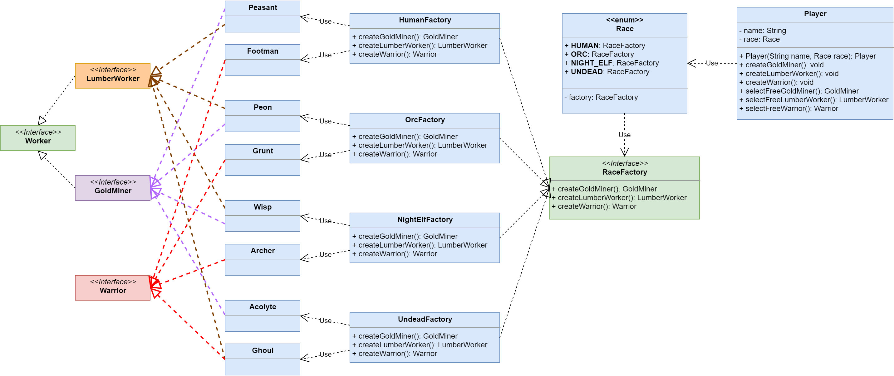

# Abstract Factory

**Абстрактная фабрика (Abstract Factory)** - порождающий шаблон проектирования, предоставляет интерфейс для создания семейств взаимосвязанных или взаимозависимых объектов, не специфицируя их конкретных классов.

Ссылка на _wiki_: [Абстрактная фабрика](https://ru.wikipedia.org/wiki/%D0%90%D0%B1%D1%81%D1%82%D1%80%D0%B0%D0%BA%D1%82%D0%BD%D0%B0%D1%8F_%D1%84%D0%B0%D0%B1%D1%80%D0%B8%D0%BA%D0%B0_(%D1%88%D0%B0%D0%B1%D0%BB%D0%BE%D0%BD_%D0%BF%D1%80%D0%BE%D0%B5%D0%BA%D1%82%D0%B8%D1%80%D0%BE%D0%B2%D0%B0%D0%BD%D0%B8%D1%8F))

## Общее

#### Описание

Существуют интерфейсы продуктов: **ProductA**, **ProductB**. И существуют реализации, связанные между собой:
 - **ConcreteProductA1** и **ConcreteProductB1**;
 - **ConcreteProductA2** и **ConcreteProductB2**.

##### Проблема

Клиенту приходится создавать наши продукты и каждый раз необходимо выбирать реализацию. Причём создавать можно только связанные объекты.

##### Решение

Создадим общий интерфейс, который содержит фабричные методы для наших продуктов - **AbstractFactory**. И для каждого семейства связанны объектов создадим по реализации этого интерфейса:
 - **ConcreteFactory1** - умеет создавать **ConcreteProductA1** и **ConcreteProductB1**; 
 - **ConcreteFactory2** - умеет создавать **ConcreteProductA2** и **ConcreteProductB2**.

Теперь клиенту нужно лишь выбрать конкретную реализацию фабрики.

#### Диаграмма

##### Легенда

 - **ProductA**, **ProductB** - интерфейсы продуктов;
 - **ConcreteProductA1** и **ConcreteProductB1** - первое семейство реализации продуктов;
 - **ConcreteProductA2** и **ConcreteProductB2** - второе семейство реализации продуктов;
 - **AbstractFactory** - интерфейс фабрики с фабричными методами для каждого продукта;
 - **ConcreteFactory1** - фабрика первого семейства реализации продуктов;
 - **ConcreteFactory2** - фабрика второго семейства реализации продуктов.
 
## Частное

#### Описание примера

Существует игра, в которой игрок играет за определённую расу и может создавать себе юнитов. (Да, всё было украдено из WarCraft 3).  
В данном примере юнитов всего 2 вида: _рабочие_ и _воины_. Среди рабочих также выделяют _добывателей золота_ и _добывателей дерева_.
Для воинов создан интерфейс **Warrior**. Для рабочих **Worker**. В свою очередь добыватель золота - **GoldMiner**. А добыватель древесениы - **LumberWorker**.
Также заранее известен интерфейс игрока: он умеет создавать воинов и рабочих, а также выделять среди них свободных и отправлять их работать или воевать.

##### Проблема

В игре существуют четыре расы, у каждой из которых свой набор юнитов.
 - Люди, Альянс. Юниты:
    - Крестьянин. Добыватель золота и древесины.
    - Пехотинец. Воин.
 - Орки, Орда. Юниты:
    - Раб. Добыватель золота и древесины.
    - Бугай. Воин.
 - Ночные эльфы. Юниты:
    - Светлячок. Добыватель золота и древесины.
    - Лучница. Воин.
 - Нежить, Плеть. Юниты:
    - Послушник. Добыватель золота.
    - Вурдалак, Гуль. Воин и добыватель древесины.
    
При создании игрока нужно указывать принадлежность к расе. После выбора необходимо опеределиться с тем, как создавать юнитов этой расы. 

##### Решение

На помощь приходит **Абстрактная Фабрика**. Создадим абстрактную фабрику для всех видов наших юнитов и создадим для каждой расы фабрику юнитов.

Также есть смысл создать перечисление **Race**, в котором мы будем хранить информацию о каждой расе. В нашем случае это будет фабрика конкретной расы.

Теперь при создании игрока мы просто будем передавать константу перечисления - расу игроку. Он в свою очередь достанет из расы фабрику и будет использовать её для создания необходимых ему юнитов.

#### Диаграмма

##### Легенда

 - **Worker** - интерфейс рабочего;
 - **GoldMiner** - интерфейс добывателя золота;
 - **LumberWorker** - интерфейс добывателя древесины;
 - **Warrior** - интерфейс воина;
 - **Peasant** - крестьянин, **Footman** - пехотинец;
 - **Peon** - раб, **Grunt** - бугай;
 - **Wisp** - светлячок, **Archer** - лучник;
 - **Acolyte** - послушник, **Ghoul** - вурдалак, гуль;
 - **HumanFactory**, **OrcFactory**, **NightElfFactory**, **UndeadFactory** - фабрики юнитов для каждой расы;
 - **RaceFactory** - абстрактная фабрика юнитов;
 - **Race** - перечисление рас, с хранимой фабрикой этой расы;
 - **Player** - игрок.
 
## Итог

#### Достоинтсва
 - Быстрая настройка системы на создание необходимого семейства объектов;
 - Сокрытие процесса создания семейства объектов;
 - Реализует _Open-Closed Principle_.
#### Недостатки
- Много классов.
- Трудность добавления нового типа продукта. Например, чтобы добавить новый вид юнитов, в нашем примере нужно:
    - добавить новый тип юнитов
    - добавить реализации этого юнита для каждый расы;
    - добавить методы создания в каждую фабрику.