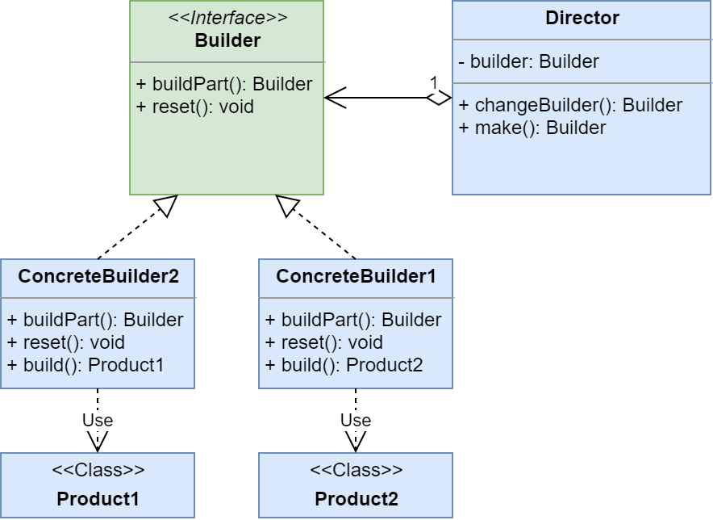
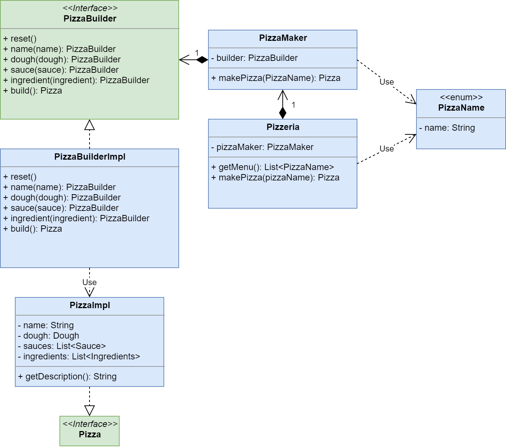

# Builder (Строитель)

**Строитель (Builder)** - порождающий паттерн проектирования, позволяющий создавать сложные объекты пошагово. Причём в результате одного и того же процесса создания объекта могут получаться разные его представления.

Ссылка на _wiki_: [Строитель](https://ru.wikipedia.org/wiki/%D0%A1%D1%82%D1%80%D0%BE%D0%B8%D1%82%D0%B5%D0%BB%D1%8C_(%D1%88%D0%B0%D0%B1%D0%BB%D0%BE%D0%BD_%D0%BF%D1%80%D0%BE%D0%B5%D0%BA%D1%82%D0%B8%D1%80%D0%BE%D0%B2%D0%B0%D0%BD%D0%B8%D1%8F))

## Общее

#### Описание
Существует один или более продуктов с одинаковым набором полей. 
В нашем случае это **Product1** и **Product2**. 
Набор полей достаточно большой. 
Интерфейс у продуктов не обязательно один.

##### Проблема №1
Из-за большого количества параметров конструкторы получились очень громоздкими. 
К тому же очень часто некотрые поля не заполняются. 

##### Проблема №2
Значения некоторых полей не всегда получается знать заранее. 
Иногда приходится сохранять часть полей во временную структуру, 
ждать получение недостающих параметров и уже затем создавать наши продукты.

##### Проблема №3
Набор полей, требуемых для создания, продуктов одинаков, 
но сами они никак с друг другом не связаны: 
не наследуются от общего предка (не берём в расчёт _Object_), 
нет общего интерфейса. 
Другими словами, конструкторы продуктов идентичны, клиентский код дублируется.

##### Решение
Создадим один интерфейс строителя таких объектов - **Builder**. 
У него будут следующие методы:
 - _reset()_ - обнуляет процесс построения объекта;
 - _buildPart()_ - конфигурирует/присвавает/конструирует часть объекта, одно из его полей.
 
Теперь осталось создать реализации этого строителя для каждого из продуктов: 
**ConcreteBuilder1** и **ConcreteBuilder2**.
Каждой реализации добавим метод для получения результата построения - _build()_.

Для управления этими строителями создадим класс **Director**. 
Клиентский код будет создавать _Директора_ и _Создателя_, 
отдавать _Создателя_ _Директору_ и дальше создавать требуемые ему объекты по шагам:
 1. просим _Директора_ сконфигурировать наш объект; 
 2. просим _Строителя_ выдать результат построения.

Т.е. клиент не будет управлять процессом построения объекта,
он лишь будет выбирать _Строителя_ и _Директора_. 
Процессом стройки будет управлять _Директор_. 
Своего рода _**Прораб**_ получается.

#### Диаграмма

##### Легенда:

 - **Product1** и **Product2** объекты, которые мы хотис создать;
 - **Builder** общий интерфейс строителя;
 - **ConcreteBuilder1** и **ConcreteBuilder2** конкретные строители наших объектов;
 - **Director** директор, объект который управляет процессом построения объекта.
 
## Частное

#### Описание 
Существует Пиццерия - **Pizzeria**.
Клиент **Client** приходит и хочет купить пиццу. 
Сначала он смотрит в меню и выбирает, 
то что ему нравится, а дальше он говорит пиццерии: 
"Сделайте, пожалуйста, мне пиццу...", - **Pizzeria#_makePizza_(PizzaName)**.

##### Проблема
Сама по себе пицца - сложное блюдо из множества игредиентов. 
Поэтому каждый раз вызывать конструктор неудобно. 
К тому же непонятно кто должен готовить эту пиццу.
Менеджер пиццерии этого не умеет.

##### Решение 
Создадим магическую печь по изготовлению пиццы - **PizzaMaker**.
Теперь она будет отвечать за приготовление пиццы.
Создавать пиццу - **Pizza** мы будем с помощью строителя.  
Для этого создадим интерфейс **PizzaBuilder** и его реализацию **PizzaBuilderImpl**.
Так как наша пицца **PizzaImpl** имеет сложную структуру: тесто, соусы, ингредиенты и название, 
то на каждую часть добавим строителю метод, для её настройки. 
Получаем слудующий набор методов строителя:
 - _reset()_ - сбрасывает конфигурацию пиццы до начального состояния;
 - _name()_ - даёт название пицце;
 - _dough()_ - присваивает вид теста;
 - _sauce()_ - присваивает соус;
 - _ingredient()_ - присваивает ингредиент;
 - _build()_ - собирает/создаёт пиццу по указанным параметрам.

В реализации строителя _соусы_ и _ингредиенты_ не присваиваются, 
а добавляются к уже сущестующим спискам, так как их может быть много.

Проводя аналогии, **PizzaBuilder** - своего рода конфигурируемый конвеер по изготовлению пиццы, 
которую мы хотим получить, а **PizzaMaker** - магическая печь, 
которая содержит и управляет **PizzaBuilder**.

#### Диаграмма
 

##### Легенда

 - **Pizza** и **PizzaImpl** интерфейс и реализации пиццы;
 - **PizzaBuilder** и **PizzaBuilderImpl** интерфейс и реализации строителя(конвеера) пицц;
 - **PizzaMaker** магическая коробка по управлению строителем пиццы;
 - **Pizzeria** пиццерия;
 - **PizzaName** название пиццы из меню пиццерии.
 
## Итоги

#### Достоинтсва
* Позволяет лаконично конструировать сложные объекты;
* Позволяет создавать объекты пошагово;
* Позволяет унифицировать процесс создания разных объектов с идентичным состоянием/набором полей.
#### Недостатки
* Дополнительные классы;
* Появляется возможность получить ошибку создания объекта в _Runtime_, 
так как для компилятора код будет валидным.