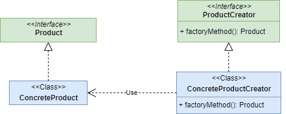
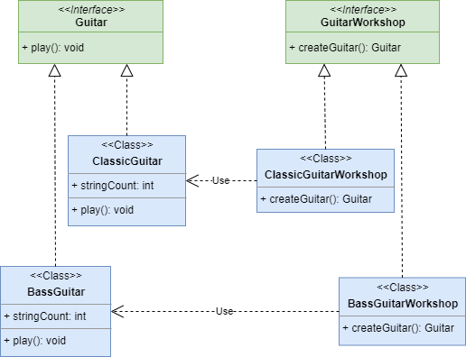

# Factory Method

**Фабричный метод (Factory method)** - порождающий паттерн проектирования, предоставляющий своим подклассам (дочерним классам) интерфейс для создания экземпляров некоторого класса.  
Ссылка на 

## Общее

#### Описание
Существует интерфейс какого-то объекта - **Product**. И существует реализация этого интерфейса - **ConcreteProduct**. 
##### Проблема №1:
Каждый раз при создании нашего продукта необходимо выполнять какие-либо дополнительные действия, дополнительную логику. И эти действия никак не связаны непосредственно с созданием, они лишь требуются для этого. В таком случае не хочется эту логику нести в конструктор объекта. 
##### Проблема №2:
Появилась ещё одна реализация интерфейса **Product** - **ConcreteProduct2**. И теперь нам нужно в одном случае иметь продукт первой реализации, а в другом случае - продукт второй реализации.
##### Решение:
Создадим интерфейс "создателя" нашего продукта - **ProductCreator**. И создадим реализацию - **ConcreteProductCreator**. 
В свою очередь у создателя должен быть метод, создающий наш продукт, - **_factoryMethod(): Product_**.
Данный метод как раз и является методом, реализующим паттерн проектирования - **Фабричный метод**.

Создатель решает обе наши проблемы. В первом случае, дополнительная логика инкапсулируется в методе **_factoryMethod(): Product_**. Во втором случае, теперь создатель решает какую реализацию использовать в том или ином случае. 

#### Диаграмма

##### Легенда:

 - **Product** - интерфейс создаваемых объектов;
 - **ConcreteProduct** - создаваемый объект, реализует интерфейс *Product*;
 - **ProductCreator** - интерфейс с фабричным методом, создающим новый экземпляр объектов *Product*;
 - **ConcreteProductCreator** - класс с фабричным методом, создающим новый экземпляр объекта *ConcreteProduct*, реализует интерфейс *ProductCreator*.

## Частное

#### Описание примера

Существует объекты - _Гитары_, которые имеют интерфейс **Guitar**. И существует всего две реализации этиг гитар - **ClassicGuitar** и **BassGuitar**.

##### Проблема

Мы магизин гитар. И к нам приходят разные клиенты, со своими разными запросами: одни хотят классические гитары, другие басс-гитары. Сами мы не можем создавать гитары, это сложно. Например, нужно знать сколько струн у какой гитары, как правильно их поставить, какую толщину выбрать и так далее. Мы хотим лишь продавать!  

##### Решение

Создадим гитарные мастерские. Одна мастерская будем создавать акустические гитары, другая басс-гитары. Теперь когда к нам придёт клиент и попросит новую гитару, мы в свою очередь попросим мастерскую создать гитару и после этого вручим её клиенту. Выбор мастерской напрямую зависит от клиента. Теперь все заняты своим делом и счастливы. 

#### Диаграмма
 

##### Легенда

 - **Guitar** - интерфейс создаемых объектов, гитар;
 - **ClassicGuitar** и **BassGuitar** - создаваемые объекты, классическая гитара и басс-гитара;
 - **GuitarWorkshop** - интерфейс с фабричным методом, мастерская по созданию гитар;
 - **ClassicGuitarWorkshop** и **BassGuitarWorkshop** - классы, реализующие фабричный метод для конкретных гитар, умеют создавать классические гитары и басс-гитары соответственно.

## Итог
#### Достоинства:
* позволяет сделать код более универсальным, не привязываюсь к конкретным классам, а оперируя лишь общим интерфейсом
* выделяет код инстанциирования в одно место, упрощая поддержку кода
* упрощает добавление новых конкретных реализаций 

#### Недостатки:
* может привести к созданию больших параллельных иерархий классов, так как для каждой конкретной реализации требуется создать свой подкласс создателя 