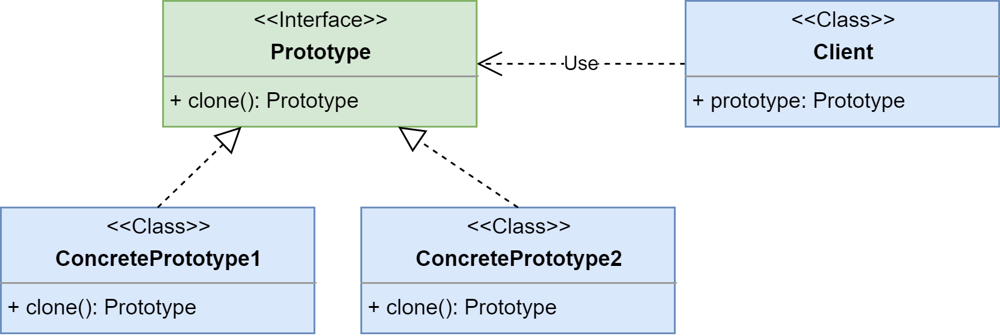
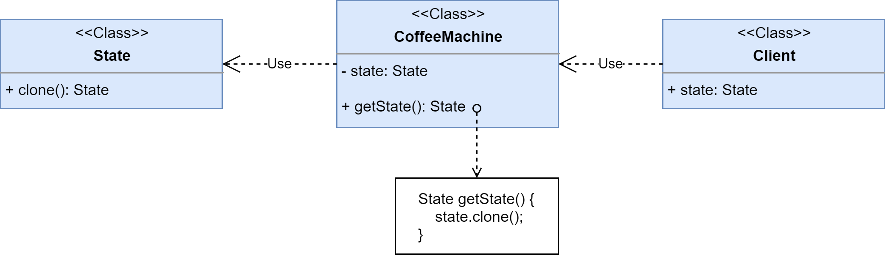

# Factory Method

**Прототип (Prototype)** - порождающий паттерн проектирования, который позволяет копировать объекты, 
не вдаваясь в подробности их реализации.

Ссылка на _wiki_: [Прототип](https://ru.wikipedia.org/wiki/%D0%9F%D1%80%D0%BE%D1%82%D0%BE%D1%82%D0%B8%D0%BF_(%D1%88%D0%B0%D0%B1%D0%BB%D0%BE%D0%BD_%D0%BF%D1%80%D0%BE%D0%B5%D0%BA%D1%82%D0%B8%D1%80%D0%BE%D0%B2%D0%B0%D0%BD%D0%B8%D1%8F))

## Общее

#### Описание
Существует интерфейс какого-то объекта - **Prototype**. И существуют реализации этого интерфейса - **ConcretePrototype1** и **ConcretePrototype2**.
##### Проблема №1:
Создавать новые объекты этих реализаций дорого, да и к тому же решать какая конкретная реализация необходима
в данный момент хочется динамически. Также обычно экземпляры существуют, но хочется использовать не их сами, 
а создать подобный и настроить под себя.
##### Решение:
Добавим в интерфейс метод _clone()_, а в реализациях будем клонировать сами себя: создавать новые объекты и 
наполнять их таким же состоянием что и у эталонного. 

#### Диаграмма

##### Легенда:

 - **Prototype** - интерфейс наших объектов, который умеет клонировать себе подобные объекты;
 - **ConcretePrototype1** и **ConcretePrototype2** - создаваемые через клонирования себя же объекты, 
 реализующие интерфейс *Prototype*;
 - **Client** - клиентский класс, который хочет создавать подобные эталонному объекты, причём не зная реализации.

## Частное

#### Описание примера

Существует кофе-машина, которая имеет состояние. Состояние в свою очередь в себе хранит информацию о ресурсах:
 кофе, вода, молоко, сахар, стаканчики, а также о текущем приготавливаемым напитке, готовности этого напитка и др. 
 
##### Проблема

Перед готовкой напитка машина проверяет все свои ресурсы и хочет быть полностью уверена, 
что их достаточно для выбранного напитка. Для этого она берёт текущее состояние и с ним проходит по всем ресурсам, 
вычисляя остаток после приготовления и, если всё ок, приступает к готовке напитка.

Проблема в том, что в середине процесса проверки и вычисления остаточных ресуров может стать известно, что какого-то
конкретного ресурса не хватает и тогда придётся откатывать изменения. А что хуже всего, вся эта история
может закончиться непредвиденной ошибкой и мы получим некорректное состояние кофе-машины.
 
##### Решение

Добавим в состояние машины метод клонирования, который будет каждый раз отдавать нам клона состояния. 
Теперь кофе-машина будет работать не с настоящим состоянием, а с его клоном, а в конце процесса приготовления
напитка будет просто обновлять состояние из клона. Это позволит избавиться от проблем с возможностью сломать
состояние и кофе-машину в целом.

#### Диаграмма
 

##### Легенда

 - **State** - объект, хранимый состояние кофе-машины;
 - **CoffeeMachine** - объект, управляющий кофе-машиной;
 - **Client** - любой сторонний объект (обработчик), который работает с состоянием.

## Итог
#### Достоинства:
* позволяет клонировать объекты, не завязываясь на реализации;
* в некоторых случаях ускоряет создание объектов;
* упрощает создание объектов, зная эталонный;
* позволяет избежать поломок критически важных объектов.

#### Недостатки:
* сложно клонировать объекты с глубой вложенностью (когда сложные объекты внутри других сложных).