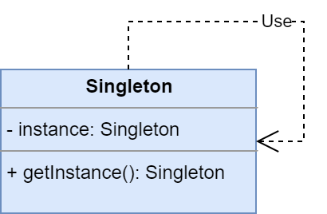
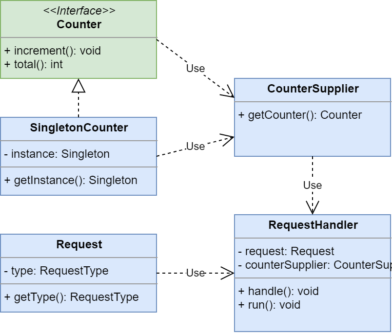

# Singleton

**Singleton** - пораждающий паттерн проектирования, гарантирующий, 
что в приложении будет единственный экземпляр некоторого класса, 
и предоставляющий глобальную точку доступа к этому экземпляру.

Ссылки:
 - _wiki_ - [Singleton](https://ru.wikipedia.org/wiki/%D0%9E%D0%B4%D0%B8%D0%BD%D0%BE%D1%87%D0%BA%D0%B0_(%D1%88%D0%B0%D0%B1%D0%BB%D0%BE%D0%BD_%D0%BF%D1%80%D0%BE%D0%B5%D0%BA%D1%82%D0%B8%D1%80%D0%BE%D0%B2%D0%B0%D0%BD%D0%B8%D1%8F))
 - habr - [Правильный Singleton в Java](https://habr.com/ru/post/129494/)

Вся информация здесь - пересказ из вышеуказанных ссылок.

## Общее

#### Описание

Существует класс **Singleton**, который по своей сущности должен быть 
в приложении один.

##### Проблема

Нужно предоставить механизм создания экземпляра требующегося класса 
в одном количестве. А также предоставить к нему доступ из любой точки приложения.

##### Решение

Так как мы знаем, что статические, финальные поля класса создаются 
один раз при загрузке класса и больше их нельзя переопределить, 
то завяжемся на этом. Определеим в нашем классе **Singleton** приватное, 
статическое, финальное поле _instance_ с типом нашего класса и тут же создадим 
экземпляр класса, используя приватный конструктор. Для доступа к объекту 
создадим публичный, статический метод - _Singleton getInstance()_, 
который вернёт наш экземпляр. 
 ```java
public class Singleton {    

    private static final Singleton instance;

    private Singleton() {
        // Конструирование нашего объекта.
    }

    public static Singleton getInstance() {
        return instance;
    }   
}
```

##### Диаграмма


## Частное

#### Описание примера

У нас есть многопоточное приложение (очень грубо), которое получает список 
запросов **Request** и обрабатывает каждый запрос с помощью пула потоков 
(в количестве 10 штук).
Обработкой занимается **RequestHandler**.

##### Проблема

Мы, как владельцы приложения, заметили, что иногда в этот список попадают 
запросы-ошибки. Для определения у запроса есть его тип - **RequestType**.
Один из этих типов - **RequestType.ERROR**.
Для сбора статистики по ошибочным запросам было принято решение посчитать
общее количество подобных ошибочных запросов.
 
##### Решение

Для подсчёта создадим интерфейс **Counter**, который будет считать наши
ошибочные запросы. У него будет два метода: 
 - _increment_ - увеличивает счётчик;
 - _total_ - возвращает текущее значение счётчика.
 
Про реализацию поговорим чуть ниже.

Теперь в **RequestHandler** в методе обработки будем увеличивать счётчик
каждый раз, когда тип обрабатываемого запроса - ошибочный.

Причём здесь _Singleton_? 
А притом, что у нас 10 потоков обрабатывают запросы одновременно. 
А посчитать мы должны общее количество ошибочных запросов.
Поэтому стоит просто сказать **RequestHandler** какой класс нужный ему
счётчик и он сам достанет экземпляр этого класса и будет 
с ним работать. Ошибок в записи нет, так как потоки-обработчики только 
пишут, а не читают. Чтением будет заниматься отдельный поток, который будет
читать через равные промежутки времение текущее значение счётчика 
и выводить его в лог.

##### Реализации наших singleton-счётчиков.

Singleton очень популярный паттерн. Поэтому существуют несколько реализаций,
которые отличаются друг от друга некоторыми параметрами. 
Главный параметр - производительность. Также часто разработчики хотят ленивый 
Singleton, т.е. Singleton, который создаётся по требованию,
при этом не стоит забывать про потокобезопасность.

###### Singleton на основе перечисления

```java
public enum EnumCounter implements Counter {
    INSTANCE;
}
```
Плюсы:
 + сериализация из коробки
 + потокобезопасность из коробки

Минусы:
 - не ленивая инициализация
 
###### Статический Singleton

```java
public class StaticCounter implements Counter {
    public static final StaticCounter INSTANCE = new StaticCounter();
}
```
Плюсы:
 + просто и понятно
 + потокобезопасность

Минусы:
 - не ленивая инициализация
 
###### Singleton с синхронизированным доступом

```java
public class SyncCounter implements Counter {

    private static SyncCounter instance;

    public static synchronized SyncCounter getInstance() {
        if (instance == null) {
            instance = new SyncCounter();
        }
        return instance;
    }
}
```

Плюсы:
 + ленивая инициализация
 + потокобезопасность
 
Минусы:
 - низкая производительность: блокируется 
   весь метод получения/инициализации экземпляра
 
###### Singleton с блокировокой с двойной проверкой (Double Checked Locking Singleton)

```java
public class DoubleCheckedLockingCounter implements Counter {

    private static volatile DoubleCheckedLockingCounter instance;

    public static DoubleCheckedLockingCounter getInstance() {
        if (instance == null) {
            synchronized (DoubleCheckedLockingCounter.class) {
                if (instance == null) {
                    instance = new DoubleCheckedLockingCounter();
                }
            }
        }
        return instance;
    }
}
```

Плюсы:
 + ленивая инициализация
 + потокобезопасность
 
Минусы:
 - нет :)
 
###### Singleton, реализубщий идиому "Владелец инициализации по требованию" (On Demand Holder Idiom Singleton)


```java
public class InitOnDemandHolderCounter implements Counter {

    public static InitOnDemandHolderCounter getInstance() {
        return CounterHolder.INSTANCE;
    }

    private static class CounterHolder {
        static final InitOnDemandHolderCounter INSTANCE = new InitOnDemandHolderCounter();
    }
}
```

Плюсы:
 + ленивая инициализация
 + потокобезопасность
 + высокая производительность
 
Минусы:
 - невозможно использовать для не статических полей

#### Диаграмма
 

##### Легенда

 - **Counter** - интерфейс счётчика;
 - **SingletonCounter** - реалзиация счётчика, которая является _Singleton_;
 - **CounterSupplier** - класс, который предоставляет реализацию счётчика;
 - **Request** - наш запрос, который нужно обработать;
 - **RequestHandler** - обработчик запросов.
 
 
## Итог

#### Достоинства:
* гарантирует наличие единственного экземпляра класса
* предоставляет глобальную точку доступа к нему

#### Недостатки:
* усложняет написание тестов
* глобальный объект может быть вредным (например, наш счётчик ещё кто-то будет инкрементировать, и в таком случае мы получив невалидные данные).