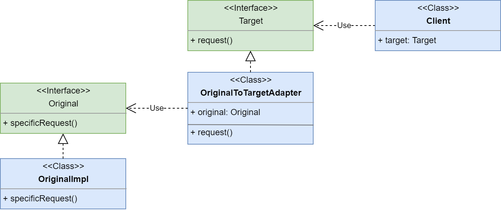
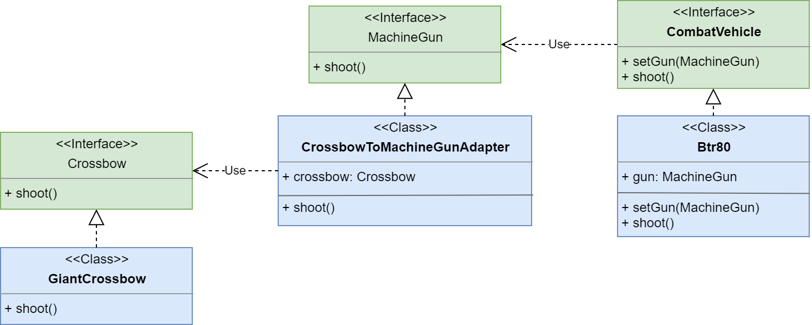

# Adapter

**Адаптер (Adapter)** - структурный шаблон проектирования, 
предназначенный для организации использования функций объекта, 
недоступного для модификации, через специально созданный интерфейс.

Ссылка на _wiki_: [Адаптер](https://ru.wikipedia.org/wiki/%D0%90%D0%B4%D0%B0%D0%BF%D1%82%D0%B5%D1%80_(%D1%88%D0%B0%D0%B1%D0%BB%D0%BE%D0%BD_%D0%BF%D1%80%D0%BE%D0%B5%D0%BA%D1%82%D0%B8%D1%80%D0%BE%D0%B2%D0%B0%D0%BD%D0%B8%D1%8F))

## Общее

#### Описание
Существует объект **OriginalImpl**, который наследует интерфейс **Original**.
 Также существует интерфейс **Target**, который используется некоторым клиентом **Client**.
 Интерфейсы **Original** и **Target** между собой похожи: 
 есть похожие методы **Original**_#specificRequest()_ и **Target**_#request()_.

##### Проблема:
Клиенту хочется использовать объекты с интерфейсом **Original** также удобно как 
и объекты с интерфейсом **Target**. Но переделывать класс клиента или интерфейс **Target** мы не можем.
##### Решение:
Создадим класс-адаптер **OriginalToTargetAdapter** который будет реализовывать интерфейс **Target**, а 
все методы делегировать внутреннему объекту с интерфейсом **Original**.

Теперь клиент сможет использовать объекты с интерфейсом **Original** вместо объектов **Target**, 
используя адаптер - **OriginalToTargetAdapter**.

#### Диаграмма

##### Легенда:

 - **Client** - класс клиента, использующего объекты с интерфейсом **Target**;
 - **Target** - интерфейс, который используется клиентом;
 - **Original** - интерфейс адаптируемого объекта;
 - **OriginalImpl** - класс, который реализует интерфейс **Original**;
 - **OriginalToTargetAdapter** - класс, который реализует адаптирует **Original** к **Target**.
 
## Частное

#### Описание примера

Существует боевая машина - **Btr80**, на которой установлено  оружее - **MachineGun**.
Одной из реализацией **MachineGun** является пулемёт КПВТ - **Kpvt**.
Все реализации данного оружия **MachineGun** умеют стрелять - **MachineGun**_#shoot()_.
Также есть ещё один вид оружия - **Crossbow**, которое также умеет стрелять **Crossbow**_#shoot().
Реализацией данного вида является Гигантский арбалет - **GiantCrossbow**.

##### Проблема

Хочется поставить на нашу боевую машину арбалет вместо пулемёта. Но у них разные интерфейсы.

##### Решение

Создадим адаптер, который позволит установить наш арбалет на боевую машину вместо пулемёта. 

#### Диаграмма
 

##### Легенда

 - **CombatVehicle** - интерфейс боевых машин;
 - **Btr80** - реализация боевой машины **CombatVehicle**;
 - **MachineGun** - интерфейс пулемётов, которые ставятся на боевые машины;
 - **Crossbow** - интерфейс арбалетов;
 - **GiantCrossbow** - гигантский арбалет, реализация интерфейса **Crossbow**;
 - **CrossbowToMachineGunAdapter** - адаптер арбалета под пулемёт.

## Итог
#### Достоинства:
* позволяет использовать объекты с похожим интерфейсом без изменений клиента
* скрывает преобразование классов/интерфейсов от клиента

#### Недостатки:
* дополнительные классы 