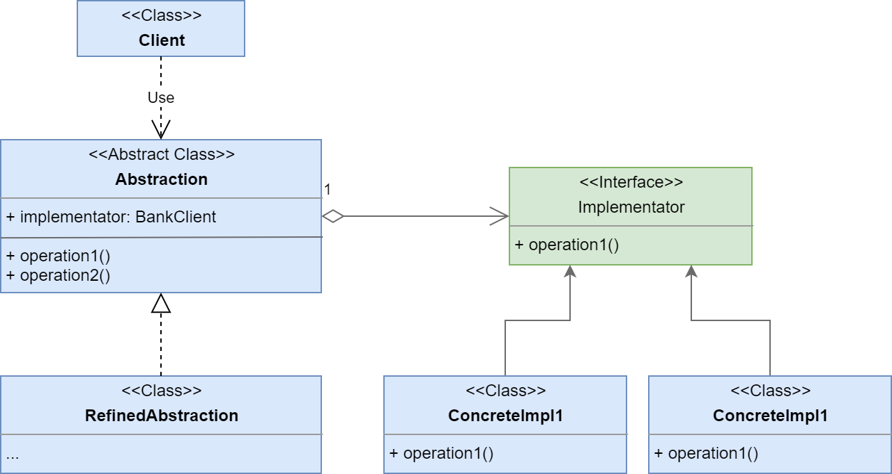
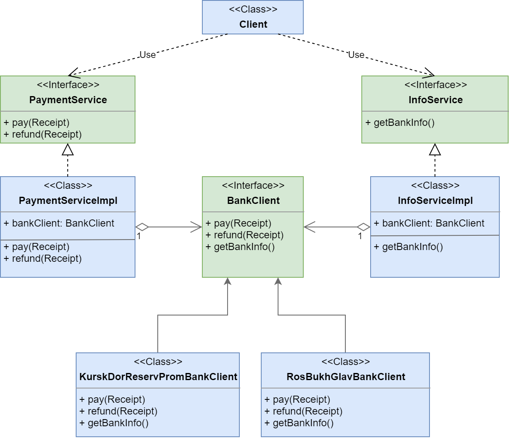

# Bridge

**Мост (Bridge)** - структурный шаблон проектирования, используемый
 в проектировании программного обеспечения чтобы «разделять абстракцию 
 и реализацию так, чтобы они могли изменяться независимо». .

Ссылка на _wiki_: [Мост](https://ru.wikipedia.org/wiki/%D0%9C%D0%BE%D1%81%D1%82_(%D1%88%D0%B0%D0%B1%D0%BB%D0%BE%D0%BD_%D0%BF%D1%80%D0%BE%D0%B5%D0%BA%D1%82%D0%B8%D1%80%D0%BE%D0%B2%D0%B0%D0%BD%D0%B8%D1%8F))

## Общее

#### Описание
Существует абстракция **Abstraction**, которая является сложной, 
например, умеет выполнять два разных вида действий.
Первое действие выполняется посредством вызова метода **Abstraction**_#operation1()_,
а второе **Abstraction**_#operation2()_.

##### Проблема:
Если мы хотим создать реализации абстракции с разным сочетанием реалазаций её поведения, 
то нам придётся дублировать код.
Например, метод **Abstraction**_#operation1()_ имеет две реализации и 
метод **Abstraction**_#operation2()_ имеет две реализации.
Итого получается 4 реализии **Abstraction**.

##### Решение:
Вынесем реализацию одного действия в отдельную иерархию - **Implementator**.
Теперь наша абстракция отвечает лишь за один вид поведения, а другой делегирует новой абстракции.

#### Диаграмма

##### Легенда:

 - **Client** - класс клиента;
 - **Abstraction** - сложная абстракция с двумя поведениями;
 - **RefinedAbstraction** - реализация **Abstraction**;
 - **Implementator** - интерфейс адаптируемого объекта;
 - **OriginalImpl** - класс, который реализует интерфейс **Original**;
 - **OriginalToTargetAdapter** - класс, который реализует адаптирует **Original** к **Target**.
 
## Частное

#### Описание примера

Существует сервис оплаты/возврата покупок - **PaymentService**. Для оплаты/возврата сервис обращается в банк
 с соответствующим запросом. В свою очередь банков существует два: _КурскДорРезервПромБанк_ и _РосБухГлавБанк_. 
 Параллельно есть сервис получения информации о используемом банке - **InfoService**.

##### Проблема

Из-за того, что есть два банка, то требуется реализовать два **PaymentService**: оджна реализации для одного банка,
другая для другого. Также для каждого из банков требуется своя реализация **InfoService**.

##### Решение

Создадим ещё одну абстракцию - **BankClient**, которая будет отвечать за обращения к конкретному банку и для неё 
создадим две реализации для каждого из банков. Далее подключим эти клиенты к нашим сервисам, используя для 
этого агрегацию. Теперь наши сервисы не сами будут обращаться в банк, а будут делегировать это созданным клиентам.

#### Диаграмма
 

##### Легенда

 - **Client** - класс клиента;
 - **PaymentService** - интерфейс сервиса оплаты/возвратов;
 - **PaymentServiceImpl** - реализация **PaymentService**;
 - **InfoService** - интерфейс сервиса получения информации;
 - **InfoServiceImpl** - реализации **InfoService**;
 - **BankClient** - интерфейс сервиса для обращения в банк;
 - **KurskDorReservPromBankClient** - реализация **BankClient** для банка _КурскДорРезервПромБанк_;
 - **RosBukhGlavBankClient** - реализация **BankClient** для банка _РосБухГлавБанк_.

## Итог
#### Достоинства:
* позволяет разбивать большие сложные объекты на части
* позволяет развивать эти части паралелльно друг другу
* уменьшает связность кода

#### Недостатки:
* дополнительные классы