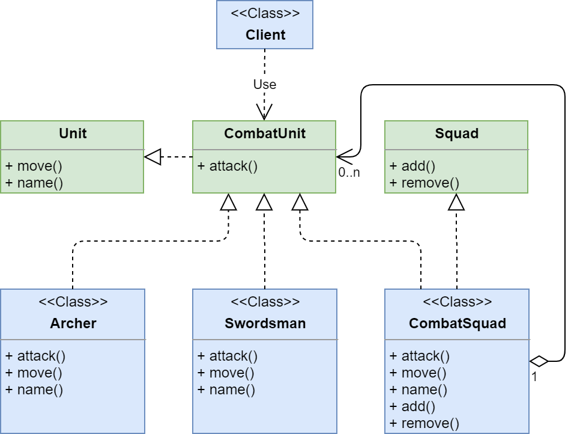

# Composite

**Компоновщик (Composite)** - структурный шаблон проектирования, объединяющий объекты 
в древовидную структуру для представления иерархии от частного к целому.

Ссылка на _wiki_: [Компоновщик](https://ru.wikipedia.org/wiki/%D0%9A%D0%BE%D0%BC%D0%BF%D0%BE%D0%BD%D0%BE%D0%B2%D1%89%D0%B8%D0%BA_(%D1%88%D0%B0%D0%B1%D0%BB%D0%BE%D0%BD_%D0%BF%D1%80%D0%BE%D0%B5%D0%BA%D1%82%D0%B8%D1%80%D0%BE%D0%B2%D0%B0%D0%BD%D0%B8%D1%8F))

## Общее

#### Описание
Существует интерфейс компонентов - **Component**. У него есть реализация - **Leaf**.

##### Проблема:
Клиент - **Client** очень часто работает не с одним компонентом, а с группой (списком).
Поэтому ему приходится у себя держать список данных компонентов и при вызове их методов
перебирать данный список и вызывать метод у каждого из компонента.
Другими словами, клиент вынужден уметь обрабатывать как один компонент, так и список компонентов.

##### Решение:
Создадим ещё одну реализацию интерфейса **Component** - **Composite**, которая будет в себе содержать группу других 
компонентов. Помимо контракта с интерфейсом **Component**, **Composite** будет иметь несколько методов:
 - _add(Component)_ - добавляет компонент в композит;
 - _remove(Component)_ - удаляет компонент, если он был добавлен ранее;
 - _getChild(Component)_ - возвращает компонент, если он был добавлен ранее.

Реализация же методов интерфейса компонента будет делегировать выполнение внутреннему списку
 компонентов, вызывая у них соответствующие методы по очереди, например, в цикле.
 
Теперь клиенту не нужно уметь обрабатывать списки компонентов.

#### Диаграмма

##### Легенда:

 - **Client** - класс клиента;
 - **Component** - интерфейс компонента;
 - **Leaf** - реализация **Component**;
 - **Composite** - реализация **Component**, которая умеет работать внутри со списком компонентов.
 
## Частное

#### Описание примера

Есть интерфейс **CombatUnit**, который расширяет интерфейс **Unit**. И есть две его реализации:
 - **Archer** - лучник;
 - **Swordsman** - мечник.

##### Проблема

Клиент у себя создаёт экземпляры лучников и мечников и отправляет их воевать.
Но когда боевых юнитов много, ему приходится по очереди выбирать каждого юнита. 
Не очень то удобно.

##### Решение

Создадим ещё одну реализацию боевого юнита - **CombatSquad** - боевой отряд. 
Теперь при создании лучника или мечника, его (созданного юнита) можно будет добавлять в отряд 
и отправлять этот отряд воевать как одного юнита. 

#### Диаграмма
 

##### Легенда

 - **Client** - класс клиента;
 - **Unit** - интерфейс обычного юнита, который знает своё имя и умеет перемещаться;
 - **CombatUnit** - интерфейс боевого юнита, который умеет атаковать и расширяет интерфейс **Unit**;
 - **Archer** - лучник, реализации **CombatUnit**;
 - **Swordsman** - мечник, реализации **CombatUnit**;
 - **Squad** - интерфейс отряда юнитов, умеет добавлять, удалять и выбирать юнитов из отряда;
 - **CombatSquad** - реализация **Squad** для боевых юнитов, также реализует интерфейс **CombatUnit**.

## Итог
#### Достоинства:
* упрощает архитектуру клиента при работе со сложной иерархией компонентов
* облегчает добавление новых компонентов

#### Недостатки:
* дополнительные классы