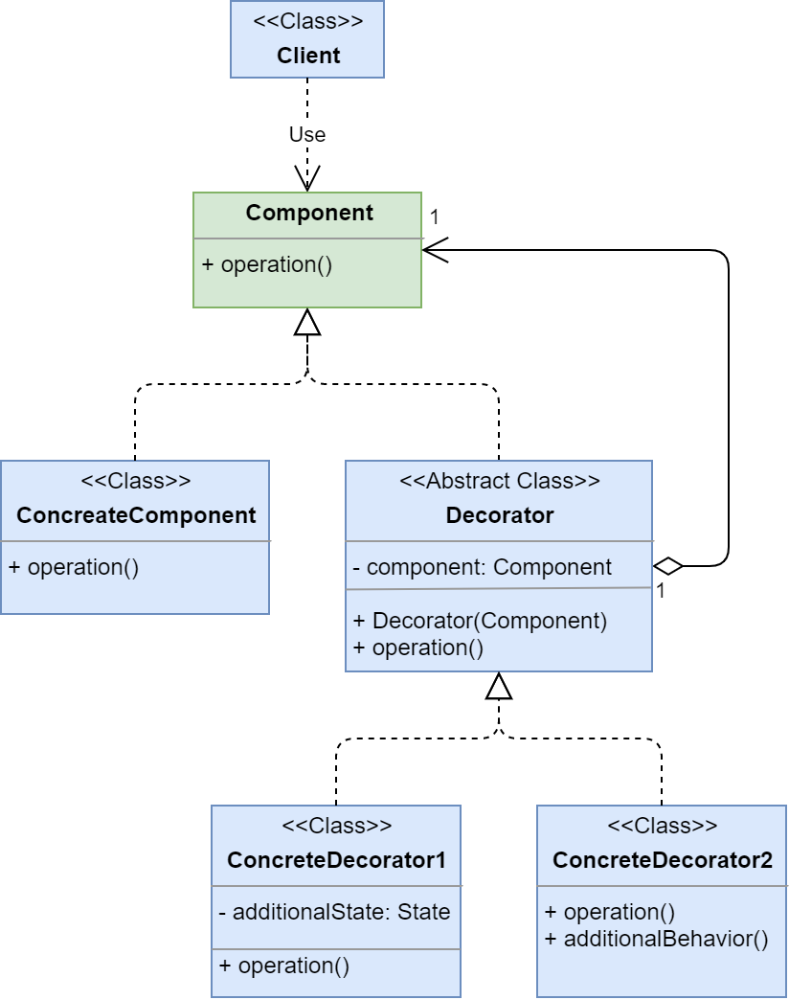
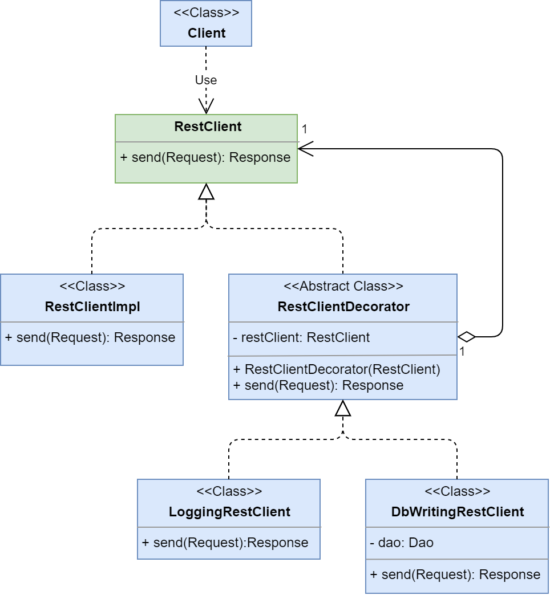

# Decorator

**Декоратор (Decorator)** - структурный шаблон проектирования, предназначенный 
для динамического подключения дополнительного поведения к объекту.

Ссылка на _wiki_: [Декоратор](https://ru.wikipedia.org/wiki/%D0%94%D0%B5%D0%BA%D0%BE%D1%80%D0%B0%D1%82%D0%BE%D1%80_(%D1%88%D0%B0%D0%B1%D0%BB%D0%BE%D0%BD_%D0%BF%D1%80%D0%BE%D0%B5%D0%BA%D1%82%D0%B8%D1%80%D0%BE%D0%B2%D0%B0%D0%BD%D0%B8%D1%8F))

## Общее

#### Описание
Есть интерфейс - **Component**, который выполняет какую-то операцию, и у него есть 
реализация - **ConcreteComponent**. 

##### Проблема:

Клиенту требуется добавить в одном случае дополнительное состояние 
для реализации - **ConcreteComponent**, а в другом случае дополнительное поведение.
Оба случая конфигурируются на стороне клиента.

С первого взгляда хочется добавить подклассы для **ConcreteComponent**, но 
этот подход добавит слишком много подклассов и получится путаница и сложность 
в настройке необходимой реализации.

##### Решение:
Создадим абстрактный класс - **Decorator**, который будет расширять любую реализацию 
**Component**, используя агрегацию.
Сам **Decorator** не будет добавлять новое состояние или поведение, это будут делать его потомки.
А **Decorator** настраивать будет клиент.

Например:
 - если клиенту нужна реализация - **ConcreteComponent**, то он получит её;
 - если клиенту нужна реализация - **ConcreteComponent** с дополнительным состоянием,
   то он получит - **ConcreteDecorator1**, который в свою очередь обернёт **ConcreteComponent**;
 - если клиенту нужна реализация - **ConcreteComponent** с дополнительным поведением,
   то он получит - **ConcreteDecorator2**, который в свою очередь обернёт **ConcreteComponent**;
 - если клиенту нужна реализация - **ConcreteComponent** с дополнительными состоянием и поведением,
   то он получит - **ConcreteDecorator2**, который обернёт **ConcreteDecorator1**, 
   а **ConcreteDecorator1** в свою очередь обернёт **ConcreteComponent**.
Дальше если нужно будет ещё одно поведение, то нам всего лишь потребуется добавить 
новую реализацию **Decorator**.

#### Диаграмма

##### Легенда:

 - **Client** - класс клиента;
 - **Component** - интерфейс компонента с каким-то поведением;
 - **ConcreteComponent** - реализация **Component**;
 - **Decorator** - реализация **Component**, которая умеет оборачивать другие **Component** 
   и добавлять им новое поведение или состояние;
 - **ConcreteDecorator1** - реализация **Decorator** с дополнительным состоянием;
 - **ConcreteDecorator2** - реализация **Decorator** с дополнительным поведением.
 
## Частное

#### Описание примера

Есть интерфейс - **RestClient**, который умеет отправлять запросы **Request** на сервер 
и получать ответы **Response**. У этого интерфейса есть реализации **RestClientImpl**. 

##### Проблема

Реализаци сама по себе делает простую вещь - отправление запроса, получение ответа и выдача его
классу, который обратился к **RestClient**. А мы захотели в одном случае логировать 
запросы/ответы в консоль/файлы, а в другом случае сохранять в БД запросы и ответы.

##### Решение

Создадим декоратор для **RestClient** - **RestClientDecorator** и для него создадим две
реализации: 
 - одна будет логировать запросы/ответы - **LoggingRestClient**;
 - другая будет писать в БД - **DbWriterRestClient**.
 
Также добавим конфиг для вкл/выкл функционала - **RestClientConfig**,
 который будет заполняться вызывающим приложением.

#### Диаграмма
 

##### Легенда

 - **Client** - класс клиента;
 - **RestClient** - интерфейс REST клиента, который отправляет запросы на сервер 
   и возвращает ответ от сервера;
 - **RestClientImpl** - обычная реализация **RestClient**;
 - **RestClientDecorator** - декоратор **RestClient**, хранит в себе другой **RestClient** в состоянии;
 - **LoggingRestClient** - подкласс **RestClientDecorator**, добавляет к поведению
   обёрнутого **RestClient** логирование;
 - **DbWritingRestClient** - подкласс **RestClientDecorator**, добавляет к поведению
      обёрнутого **RestClient** записывание в Базу данных.

## Итог
#### Достоинства:
* огромная гибкость
* облегчает добавление нового поведения

#### Недостатки:
* дополнительные классы